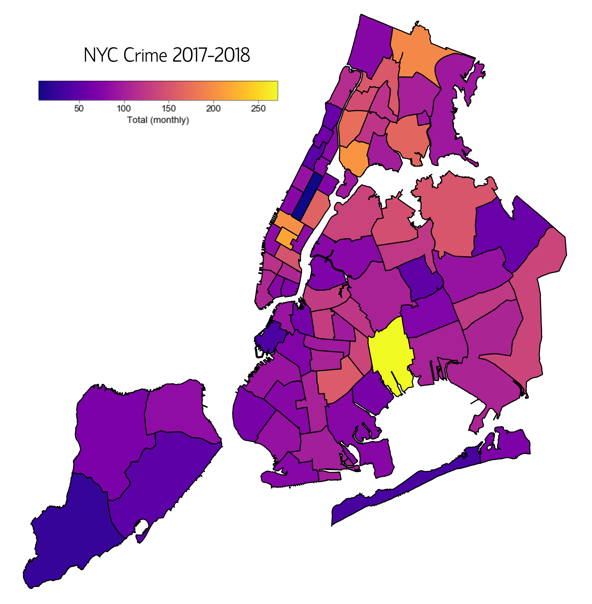
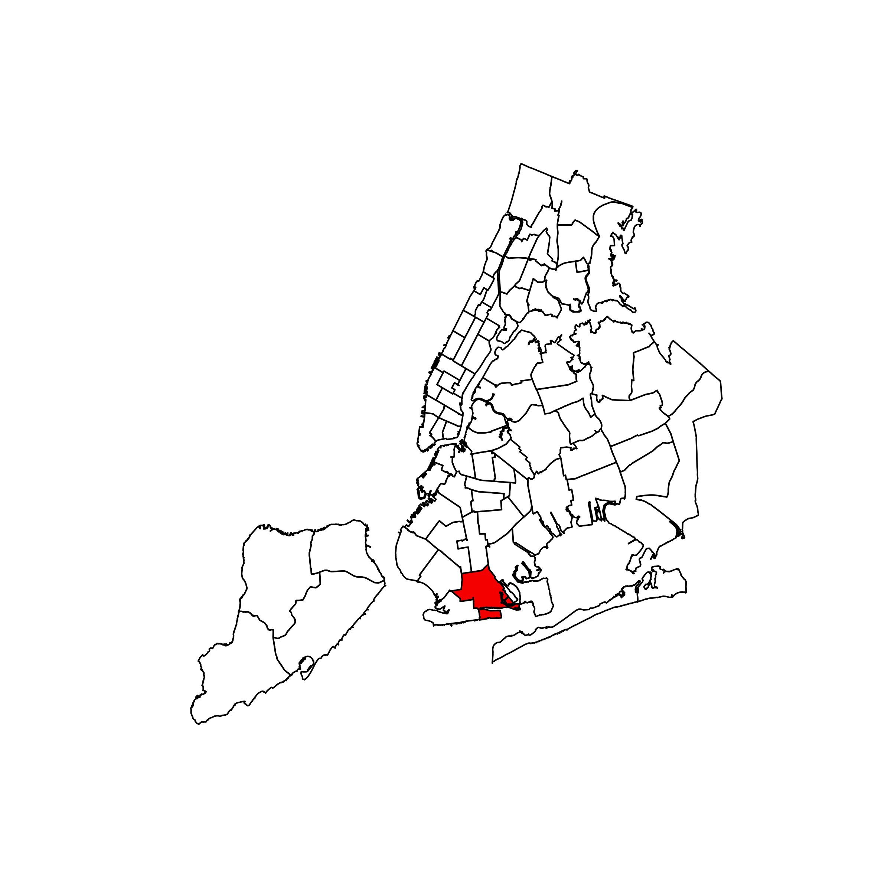
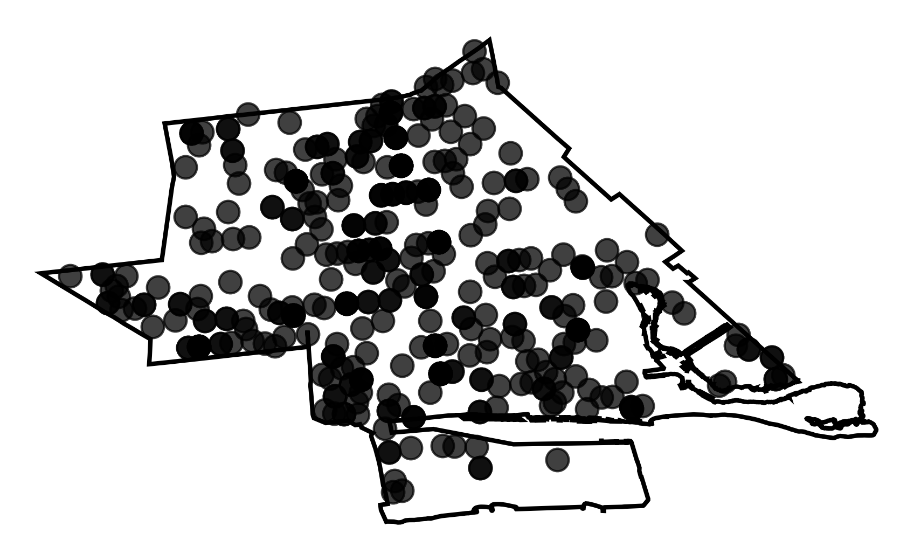
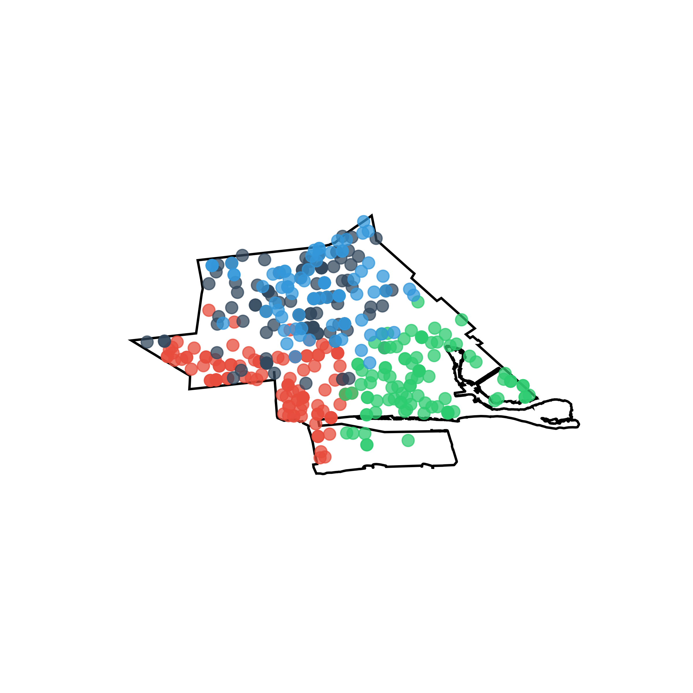
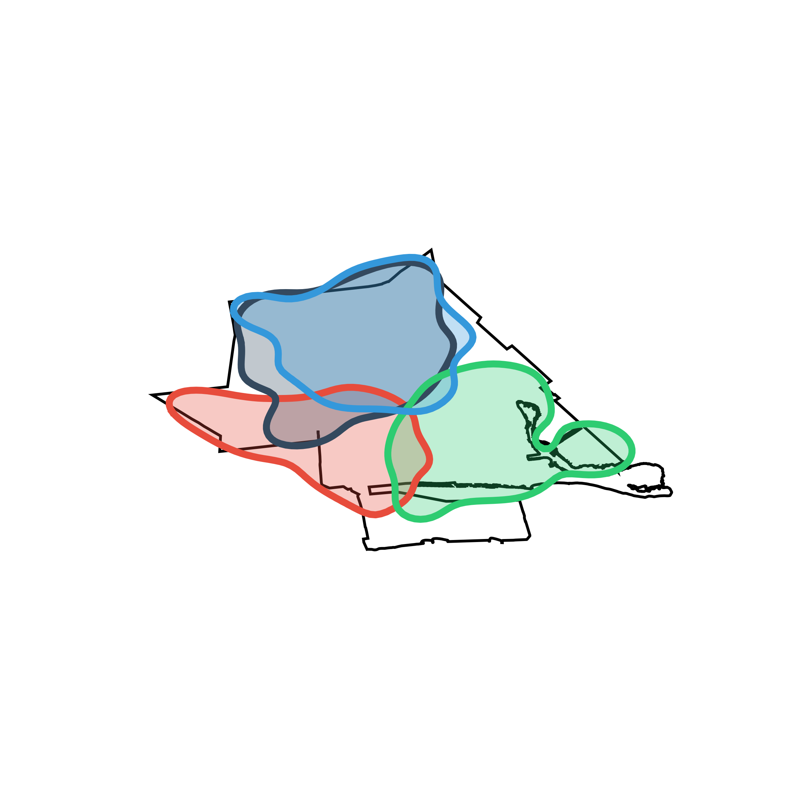
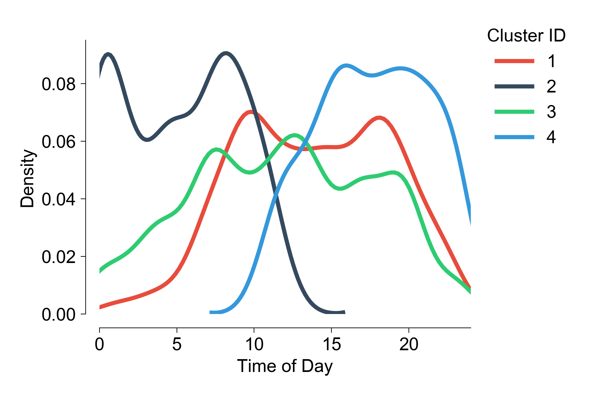
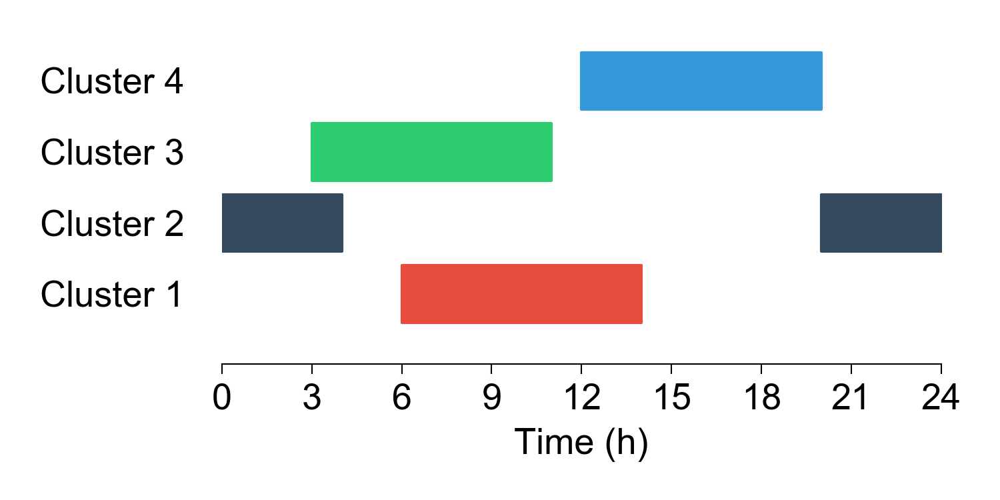
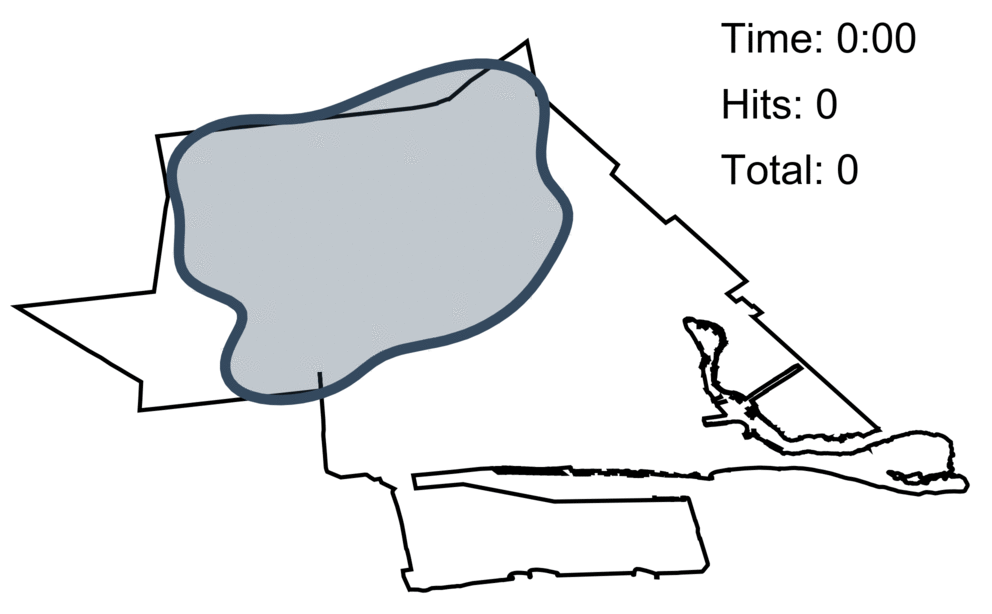

# Forecasting and spatio-temporal clustering of crime in NYC

*Ricardo Zacarias*

# Content
- [Abstract](#Abstract)

- [Datasets](#Datasets)

- [Introduction](#Introduction)

- [Forecasting crime rates in NYC](#forecasting-crime-rates-in-nyc)

- [Spatio-temporal clustering](#spatio-temporal-clustering)

- 

  

# Abstract
Using data for complaints made to the NYPD, I employed ARIMA models to forecast crime rates in New York   City. Next, I applied unsupervised spatio-temporal clustering to identify hotspots of criminal activity. Clusters were defined geographically and 

# Datasets
In this project I used publicly available data from NYC's data portal and a few other sources.

[NYPD Budget 2000-2019](https://ibo.nyc.ny.us/RevenueSpending/nypd.html)

[NYC Historical Crime Rates 2000-2019](http://www.disastercenter.com/crime/nycrime.htm)

[NYPD Complaint Data Historic (2007-2018)](https://data.cityofnewyork.us/Public-Safety/NYPD-Complaint-Data-Historic/qgea-i56i)

# Introduction

The following two charts show the evolution of the budget for the NYPD and crime rates in the city for the past 20 years. The amount of money spent on policing has nearly doubled in that period and, while crime has also seen a decline, it has remained fairly constant over the last ~10 years or so. 

Even for the initial decrease in crime rate, some studies suggest that [mental health programs](https://www.nytimes.com/2018/01/07/us/crime-police.html) or the [legalization of abortion](https://freakonomics.com/2005/05/15/abortion-and-crime-who-should-you-believe/) were the main drivers of that effect. In the end it seems that crime is not a problem you can solve by continued investment on policing. Still, law enforcement is a fundamental part of a functional community. My questions is: **can we use machine learning algorithms to optimize the distribution of resources to prevent crime?**

# Forecasting crime rates in NYC

Crime is a [notoriously seasonal](https://scholar.google.com/scholar?hl=en&as_sdt=0%2C5&q=crime+seasonality&btnG=) activity and has been studied extensively. The first step in my analysis was to see if I could forecast the total number of crimes each month. To accomplish this I used an ARIMA model including the first 10 years of the data set (2007-2016) as training to predict the last two years (2017-18). In the interest of saving memory, in this analysis I only included the following crimes:

| Violent Crime  | Property Crime   |
| -------------- | ---------------- |
| Felony Assault | Burglary         |
| Robbery        | Arson            |
| Rape           | Grand Larceny    |
| -              | Grand Theft Auto |

  

The ARIMA analysis yielded a mean absolute error of 224.7. While it looks promising, this is not how police departments work in any city. There is not one single station that is responsible for all of this crime. In fact, NYC is divided into 77 police departments (called *precincts*), so I repeated this analysis for each individual precinct.

  

This map summarizes the forecast by averaging the number of crimes in each precinct for 2017 and 2018. The raw monthly forecast for this period in each precinct can be found in this [file](https://github.com/ricardozacarias/nyc-crime-ML/blob/master/processed_csv/arima_results.csv). 

So now we know how much crime is gonna happen in each precinct, but this is still a very rough prediction and very much far from actionable information that could be used in prevention.

# Spatio-temporal clustering

In order to make more specific predictions about crime I decided to focus the analysis on only two types of crimes: **burglary** and **robbery**. I chose these two because they are both very common but they are also very different in nature.

1. *Burglary*: non-violent crime that requires some preparation and tools.
2. *Robbery*: violent crime that mostly requires opportunity.

Having selected these two different types of crimes I designed an algorithm that goes as follows.

This is an example of one precinct (61st). I will try to spatio-temporally predict crimes for January 2017 using the two years before as training (Jan 2015 - Dec 2016)

  

1. Geolocation of all the burglaries that happened inside that area during the training period.
2. Unsupervised clustering (K-Means, k=4) of events using only two features: geographical coordinates and time of day when the crime took place.

3. Once we have our clusters we fit a gaussian KDE to each cluster and extract the contour to define the geographical area.

  

4. Having defined our clusters in space, next I looked at the temporal component of each cluster. Using the peak from these distributions (mode) I calculated a vigilance schedule.

5. With these hotspots of criminal activity defined in time and space, we can now score the performance of the algorithm. I input the testing data and, if a crime happens inside of a cluster during its temporal window of activity then it is counted as a hit; if a t crime doesn't meet these two conditions, then it is a miss. How this works can be better visualized in this gif:

  

