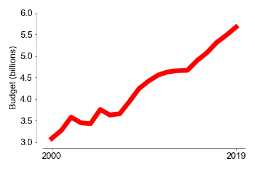
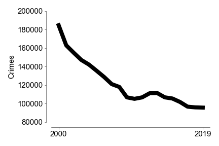
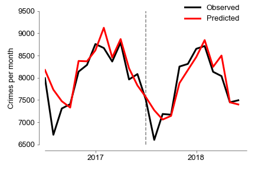

# Forecasting and spatio-temporal clustering of criminal activity in NYC

*Ricardo Zacarias*

# Content
- [Abstract](#Abstract)

- [Datasets](#Datasets)

- [Introduction](#Introduction)

- [Metrics](#Metrics)

- [Results](#Results)

- [Links](#links)

  

# Abstract
Using data for complaints made to the NYPD, I employed ARIMA models to forecast crime rates in New York  and within each of the 77 precincts in the city.

# Datasets
In this project I used publicly available data from NYC's data portal and a few other sources.

[NYPD Budget 2000-2019](https://ibo.nyc.ny.us/RevenueSpending/nypd.html)

[NYC Historical Crime Rates 2000-2019](http://www.disastercenter.com/crime/nycrime.htm)

[NYPD Complaint Data Historic (2007-2018)](https://data.cityofnewyork.us/Public-Safety/NYPD-Complaint-Data-Historic/qgea-i56i)

# Introduction

The following two charts show the evolution of the budget for the NYPD and crime rates in the city for the past 20 years. The amount of money spent on policing has nearly doubled in that period and, while crime has also seen a decline, it has remained fairly constant over the last ~10 years or so. 

Even for the initial decrease in crime rate, some studies suggest that [mental health programs](https://www.nytimes.com/2018/01/07/us/crime-police.html) or the [legalization of abortion](https://freakonomics.com/2005/05/15/abortion-and-crime-who-should-you-believe/) were the main drivers of that effect. In the end it seems that crime is not a problem you can solve by continued investment on policing. Still, law enforcement is a fundamental part of a functional community. My questions is: **can we use machine learning algorithms to optimize the distribution of resources to prevent crime?**

# Forecasting crime rates in NYC

Crime is a [notoriously seasonal](https://scholar.google.com/scholar?hl=en&as_sdt=0%2C5&q=crime+seasonality&btnG=) activity and has been studied extensively. The first step in my analysis was to see if I could forecast the total number of crimes each month. To accomplish this I used an ARIMA model including the first 10 years of the data set as training to predict the last two years (2017-18). 

The ARIMA analysis yielded a mean absolute error of 224. While it looks promising, this is not how police departments work in any city. There is not one single station that is responsible for all of this crime. 

# Results

# Location Intelligence

